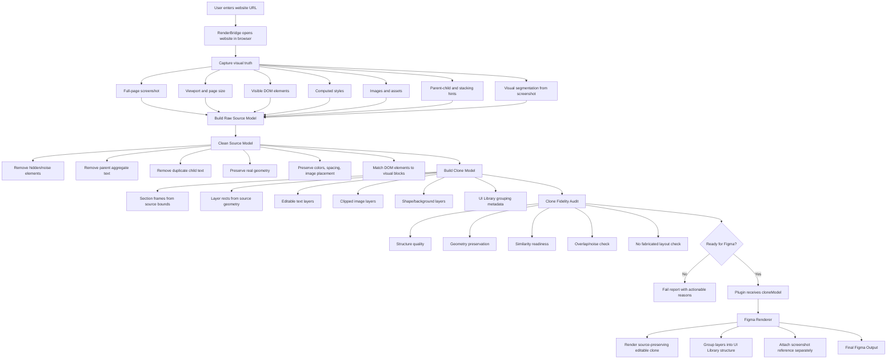

# TranslateIT Engine Flow Chart

Public version:

```txt
Version 0.1 - Alpha
```

Active engine:

```txt
translateit-core / alpha-clean-1
```

## Product Objective

TranslateIT must generate a **layout-preserving editable clone** of a website inside Figma.

The visual result must follow the target website as closely as possible. Structure can be cleaned and organized into a UI Library hierarchy, but the UI must not become a different design.

```txt
Correct:
Website source -> screenshot-first editable Figma clone that visually follows the source layout.

Wrong:
Website source -> extracted content -> new template/hallucinated layout.
```

The output must be:

```txt
visually close to the source website
editable in Figma
cleanly grouped like a UI Library
free from raw DOM noise
not a screenshot-only output
not a hallucinated redesign
```

## Core Principle

```txt
Screenshot-first, DOM-assisted.
Clone first, clean second.
```

This means the rendered screenshot is the visual truth. DOM data supports editability, text content, asset extraction, and style hints. Cleanup is allowed only to remove noise, duplicates, hidden elements, and unusable parent layers. Cleanup must not replace the source layout with a fabricated layout.

## High-Level Engine Flow



## Codia-Style Reference Principle

Codia-style tools are useful as a product reference because the important workflow is:

```txt
static visual input -> visual structure understanding -> editable design layers
```

TranslateIT must apply the same philosophy to websites:

```txt
rendered website screenshot -> visual understanding -> editable Figma clone
```

DOM extraction alone is not enough. If DOM and screenshot disagree, the screenshot wins for visual placement.

## Correct Data Pipeline

The clean engine must follow this pipeline:

```txt
URL
-> captureSite()
-> screenshot + DOM/style/assets
-> visual segmentation
-> rawSourceModel
-> cleanSourceModel
-> cloneModel
-> cloneFidelityAudit
-> plugin renderer
-> Figma editable clone
```

It must not follow this pipeline:

```txt
URL
-> extract content
-> choose generic hero/card/footer template
-> render new page layout
```
