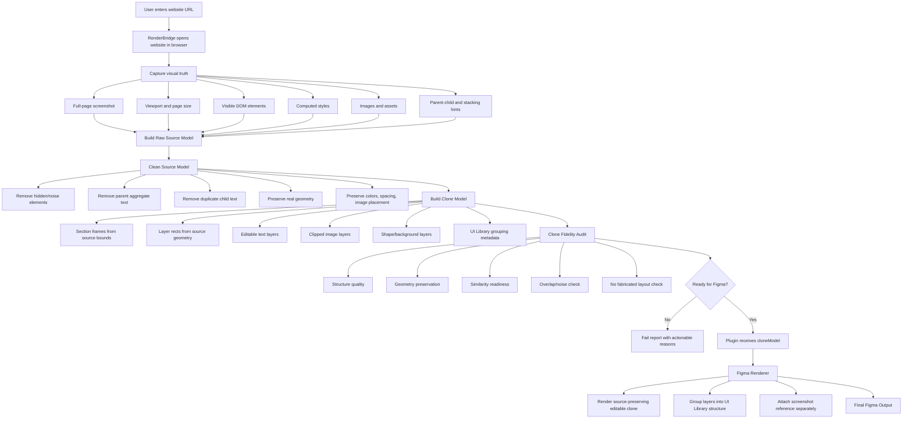
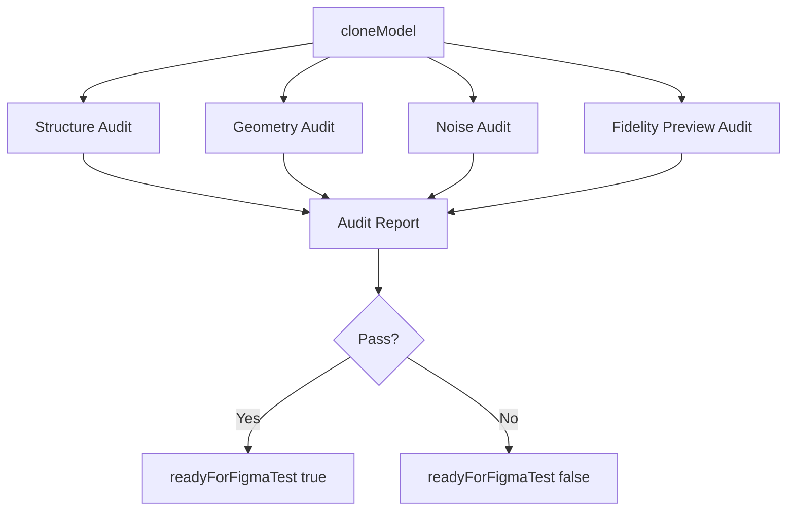

# TranslateIT Engine Flow Chart

Public version:

```txt
Version 0.1 - Alpha
```

Active engine:

```txt
translateit-core / alpha-clean-1
```

## Product Objective

TranslateIT must generate a **layout-preserving editable clone** of a website inside Figma.

The goal is not to redesign the website and not to generate a new template from website content.

```txt
Correct:
Website source -> editable Figma clone that visually follows the source layout.

Wrong:
Website source -> extracted content -> new template/hallucinated layout.
```

The output must be:

```txt
visually close to the source website
editable in Figma
cleanly grouped like a UI Library
free from raw DOM noise
not a screenshot-only output
not a hallucinated redesign
```

## Core Principle

```txt
Clone first, clean second.
```

This means source geometry is the truth. Cleanup is allowed only to remove noise, duplicates, hidden elements, and unusable parent layers. Cleanup must not replace the source layout with a fabricated layout.

## High-Level Engine Flow



## Correct Data Pipeline

The clean engine must follow this pipeline:

```txt
URL
-> captureSite()
-> rawSourceModel
-> cleanSourceModel
-> cloneModel
-> cloneFidelityAudit
-> plugin renderer
-> Figma editable clone
```

It must not follow this pipeline:

```txt
URL
-> extract content
-> choose generic hero/card/footer template
-> render new page layout
```

## Required Payload Contract

The final bridge payload must include:

```json
{
  "ok": true,
  "publicVersion": "Version 0.1 - Alpha",
  "engine": "translateit-core",
  "engineBuild": "alpha-clean-1",
  "source": {},
  "cloneModel": {},
  "diagnostics": {},
  "audit": {}
}
```

`designModel` may exist as supporting metadata, but the plugin renderer must use `cloneModel` for the main output.

## Source Model

The source model is raw captured website data.

It should contain:

```txt
source.url
source.finalUrl
source.viewport.width
source.viewport.height
source.pageHeight
source.screenshot
rawElements[]
rawAssets[]
```

Each raw element should include:

```txt
id
parentId
tag
role hint
text
directText
rect x/y/w/h
computed style
z-index / stacking hint
opacity
visibility
image asset id
children count
```

## Clean Source Model

The clean source model removes bad DOM data while preserving real layout.

Allowed cleanup:

```txt
remove hidden elements
remove display:none / visibility:hidden / opacity:0
remove zero-size elements
remove parent aggregate text
remove duplicate text
remove script/tracking/noise elements
remove image overlay text if already baked into captured image
merge obvious repeated text fragments
```

Not allowed cleanup:

```txt
move hero to a new position
resize images into a generic card layout
invent a three-column footer
change source section order
replace source geometry with template geometry
fabricate content cards from unrelated text
```

## Clone Model

`cloneModel` is the main model used by the Figma plugin.

It must be layout-preserving.

```json
{
  "mode": "layout-preserving-editable-clone",
  "page": {
    "width": 1440,
    "height": 2400,
    "background": "#FFFFFF"
  },
  "sections": [
    {
      "id": "section-hero",
      "role": "hero",
      "name": "Section / Hero",
      "rect": { "x": 0, "y": 120, "w": 1440, "h": 620 },
      "layerIds": []
    }
  ],
  "layers": [
    {
      "id": "hero-title",
      "type": "text",
      "role": "title",
      "name": "Hero / Title",
      "sectionId": "section-hero",
      "rect": { "x": 120, "y": 210, "w": 420, "h": 110 },
      "text": "Unlocking Potential Through Cultural Games",
      "style": {
        "fontSize": 42,
        "fontWeight": 700,
        "color": "#111827",
        "lineHeight": 48
      }
    }
  ],
  "assets": [],
  "tokens": {}
}
```

## Plugin Renderer Responsibility

The Figma plugin must not invent layout.

The plugin should:

```txt
validate engine contract
read cloneModel
create root frame
create section frames from cloneModel.sections
render layers from cloneModel.layers using source rects
scale source rects only when needed
clip images properly
render text as editable text layers
name layers cleanly
append screenshot reference separately
```

The plugin should not:

```txt
create generic hero layout
create generic card grid
create generic footer columns
move source elements to new template positions
fabricate placeholder sections as final clone
```

## UI Library Structure

Even though geometry must follow the source website, layer organization must remain clean.

Expected Figma tree:

```txt
01 Layout-Preserving Editable Clone
  Section / Header
    Header / Brand
    Header / Navigation
    Header / CTA
  Section / Hero
    Hero / Copy
    Hero / Media
    Hero / CTA
  Section / Content
    Content / Card
    Content / Image
    Content / Body
  Section / Footer
    Footer / Brand
    Footer / Links
02 Screenshot Reference / Pure Source
```

## Audit Flow

The audit must check both structure and source fidelity.



## Required Audit Metrics

The report should include:

```txt
cloneMode
layoutPreservationScore
visualSimilarityScore
geometryScore
sectionOrderScore
imagePlacementScore
textPlacementScore
overlapScore
noiseScore
layerCleanlinessScore
editableLayerScore
fabricatedLayoutRisk
readyForFigmaTest
```

Hard fail if:

```txt
cloneModel is missing
cloneMode is not layout-preserving-editable-clone
fabricatedLayoutRisk is high
visualSimilarityScore is below threshold
hero image moved far from source
footer layout fabricated from template
section order changed
major text overlap exists
raw parent text exists
screenshot is used as the main output
```

## Fidelity Preview Requirement

The best audit should generate a browser-side preview from `cloneModel` and compare it with the captured source screenshot.

```txt
source screenshot
vs
clone preview screenshot
```

This allows the engine to catch hallucinated/template outputs before asking the user to test in Figma.

If full visual diff is not available yet, the first implementation must at least compare geometry:

```txt
section y positions
image bounding boxes
primary title position
footer position
background colors
asset count
section order
```

## Correct Modes

TranslateIT may later support two modes, but default must be clone mode.

```txt
Default Mode: Editable Clone
- Preserve website layout.
- Clean noise.
- Render editable Figma layers.

Optional Mode: Clean Rebuild
- Create a redesigned layout from source content.
- This must never be used as default clone output.
```

## Current Direction Correction

The previous `professional-section-based-ui-library` renderPlan is not suitable as the main clone output because it can create a clean but hallucinated layout.

The correct direction is:

```txt
replace renderPlan template output
with layout-preserving cloneModel output
```

## Implementation Stages

### Stage 1 — Update Contract

```txt
Add cloneModel to payload.
Require cloneModel in contract.
Keep designModel only as supporting metadata.
```

### Stage 2 — Build Clone Model

```txt
Use cleaned DOM geometry.
Create section frames from source bounds.
Create editable layers from source rects.
Preserve image placement and crop.
Preserve real text hierarchy.
```

### Stage 3 — Rewrite Plugin Renderer

```txt
Render cloneModel.layers.
Do not render generic templates.
Group by cloneModel.sections.
Keep screenshot reference separate.
```

### Stage 4 — Add Clone Fidelity Audit

```txt
Measure geometry preservation.
Measure section order.
Measure image placement.
Measure text placement.
Detect fabricated layout risk.
```

### Stage 5 — Figma Test

Only ask for manual Figma testing when:

```txt
readyForFigmaTest: true
cloneMode: layout-preserving-editable-clone
fabricatedLayoutRisk: low
visualSimilarity/geometry metrics are acceptable
```

## Definition of Done

TranslateIT clean engine is acceptable when:

```txt
one active engine
no active legacy path
cloneModel is required
plugin renders cloneModel, not templates
main output visually follows the source website
layers are clean and editable
screenshot is reference only
report measures clone fidelity
sample sites pass without hardcoded logic
```
