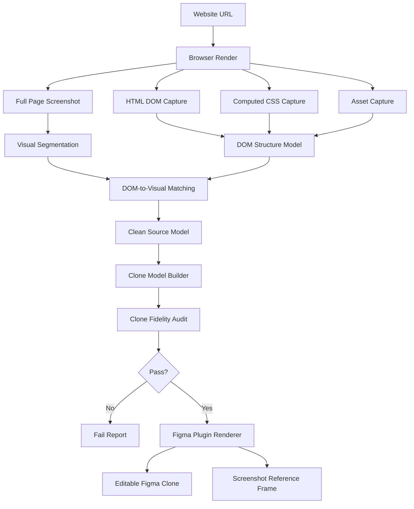

# TranslateIT Visual-First Editable Clone Specification

Public version:

```txt
Version 0.1 - Alpha
```

Active engine:

```txt
translateit-core / alpha-clean-1
```

## Purpose

This document defines the professional development direction for TranslateIT.

TranslateIT must become a website-to-Figma plugin that produces a visually accurate, editable Figma clone of a target website.

The target is not a new design, not a template rebuild, and not a raw DOM dump. The target is an editable Figma reconstruction that visually follows the source website as closely as possible.

## Main References

TranslateIT development should be guided by two product references:

```txt
1. HTML-to-Figma Design
2. Screenshot-to-Figma
```

The correct product direction combines both references:

```txt
HTML-to-Figma gives structure, text, CSS, assets, DOM metadata, and editability.
Screenshot-to-Figma gives visual truth, layout fidelity, visual segmentation, and pixel-level correctness.
```

Therefore TranslateIT must use this combined approach:

```txt
Screenshot-first, HTML-assisted, editable clone.
```

## Product Principle

```txt
Visual fidelity is the highest priority.
Editable structure is the second priority.
UI Library organization is the third priority.
```

This means:

```txt
The UI must look like the target website first.
The layer structure may be optimized and cleaned by the system.
The structure does not need to follow the original DOM 100%.
The structure must still be easy to edit using a UI Library style hierarchy.
```

## Non-Negotiable Rule

TranslateIT must never return a result that looks different from the target website and call it successful.

Hard fail if:

```txt
output looks like a redesign
output looks like a generic template
output uses website content but changes layout
hero/header/footer differ strongly from source
image placement differs strongly from source
section order differs from source
screenshot is used as the main final output
```

## Correct Mental Model

Wrong model:

```txt
Website URL
-> Extract DOM/content
-> Generate clean hero/card/footer template
-> Render new design in Figma
```

Correct model:

```txt
Website URL
-> Render website in browser
-> Capture screenshot as visual truth
-> Capture HTML/CSS/assets as editability metadata
-> Match visual blocks with DOM elements
-> Build cloneModel
-> Render editable Figma clone that follows source geometry
```

## Engine Architecture



## Source of Truth

The rendered screenshot is the visual truth.

HTML/DOM is supporting metadata.

```txt
Screenshot controls:
- final visual positions
- final visual sizes
- visual grouping
- section order
- image placement
- visible background areas
- real rendered composition

HTML/DOM controls:
- text content
- image source
- CSS style hints
- semantic role hints
- link/button semantics
- accessibility labels
- parent-child hints
```

If screenshot and DOM disagree, the screenshot wins for visual placement.

## Required Models

### 1. rawSourceModel

Raw capture from browser.

```txt
source URL
final URL
viewport size
page size
screenshot
raw DOM elements
raw computed styles
raw assets
stacking hints
parent-child relation
```

### 2. visualModel

Visual segmentation from screenshot.

```txt
visual blocks
visual text regions
visual image regions
visual shape/background regions
visual containers/cards
visual section bounds
visual color samples
```

### 3. cleanSourceModel

Cleaned and matched website model.

```txt
hidden elements removed
duplicate parent text removed
aggregate text removed
DOM matched to visual blocks
visual geometry preserved
style hints normalized
assets mapped to visible regions
```

### 4. cloneModel

Main contract used by the Figma plugin.

```json
{
  "mode": "layout-preserving-editable-clone",
  "visualTruth": "screenshot-first-html-assisted",
  "page": {
    "width": 1440,
    "height": 2400,
    "background": "#FFFFFF"
  },
  "sections": [],
  "layers": [],
  "assets": [],
  "tokens": {},
  "uiLibrary": {}
}
```

The plugin renderer must use `cloneModel` for the main output.

## cloneModel Layer Types

The clone model should support:

```txt
text
image
shape
button
icon
svg
container
section-background
```

Each layer must include:

```txt
id
type
role
name
sectionId
rect
style
text
assetId
zIndex
editable
confidence
sourceReason
```

## UI Library Structure

The original DOM structure does not need to be copied exactly.

The output structure should be system-managed and designer-friendly.

Expected layer hierarchy:

```txt
01 Layout-Preserving Editable Clone
  Section / Header
    Header / Brand
    Header / Navigation
    Header / CTA
  Section / Hero
    Hero / Title
    Hero / Body
    Hero / Media
    Hero / CTA
  Section / Content
    Content / Group
    Content / Card
    Content / Image
    Content / Text
  Section / Footer
    Footer / Brand
    Footer / Links
    Footer / Social
02 Screenshot Reference / Pure Source
```

The visual result must follow the source website. The internal structure may be cleaner than the source DOM.

## Renderer Rules

The Figma plugin renderer must be simple and deterministic.

It must:

```txt
validate cloneModel
create root frame
create section frames from cloneModel.sections
render cloneModel.layers by source rect
scale coordinates proportionally
clip image layers
render text as editable Figma text
render shapes as editable vectors/rectangles
group layers by section and role
append screenshot reference separately
```

It must not:

```txt
invent layout
create generic hero
create generic card grid
create generic footer columns
move source elements into a template
fabricate placeholder layout as final output
```

## Visual Segmentation Requirements

To move closer to Screenshot-to-Figma quality, the engine must detect visual blocks from screenshot.

Required block categories:

```txt
text regions
image regions
background regions
container/card regions
button regions
icon regions
section boundaries
large color surfaces
```

Visual segmentation is used to correct DOM problems such as:

```txt
CSS transform changes visual position
pseudo-elements not visible in DOM capture
background image not captured as normal image
parent DOM text duplicates child text
image crop differs from image source
SVG/icon rendered differently from DOM structure
```

## DOM-to-Visual Matching

Each final editable layer should be created from the best match between visual block and DOM element.

Matching signals:

```txt
rect overlap
text similarity
image asset similarity
style similarity
parent section proximity
z-index / stacking order
semantic role
```

Example:

```txt
Visual block detects title at x/y/w/h.
DOM element provides text and CSS font style.
cloneModel layer uses visual rect + DOM text/style.
```

## Fallback Strategy

When perfect editable reconstruction is not possible, visual fidelity still wins.

Fallback examples:

```txt
If text wrap differs, use browser line rects or split into editable line groups.
If font is unavailable, use closest font but preserve size, weight, and position.
If icon cannot be converted to vector, use cropped image fallback.
If CSS pseudo-element is missing from DOM, reconstruct from screenshot as shape/image.
If image object-fit crop is hard to map, use screenshot-cropped asset.
If DOM data is incomplete, preserve visual block as editable approximation or cropped fallback.
```

Fallback must never create a different layout.

## Audit Requirements

A passing report must prove both structure quality and visual fidelity.

Required metrics:

```txt
cloneMode
visualTruth
visualSimilarityScore
geometryPreservationScore
sectionOrderScore
imagePlacementScore
textPlacementScore
colorSimilarityScore
sourceCoverageScore
editableLayerScore
layerCleanlinessScore
rawNoiseScore
fabricatedLayoutRisk
overlapScore
readyForFigmaTest
```

Hard fail if:

```txt
cloneModel missing
cloneMode is wrong
visualSimilarityScore below threshold
geometryPreservationScore below threshold
fabricatedLayoutRisk high
major text/image overlap exists
section order changed
image placement moved far from source
footer/header/hero differ strongly from source
output resembles a generated template
```

## Required Preview Audit

Before manual Figma testing, the engine should generate a local preview from `cloneModel`.

```txt
source screenshot
vs
cloneModel preview screenshot
```

The preview comparison should measure:

```txt
pixel similarity
geometry similarity
dominant color similarity
block position similarity
section order similarity
image region similarity
```

This prevents asking the user to test in Figma when the output is already visually wrong.

## Default Mode

Default mode:

```txt
Editable Clone
```

Future optional mode:

```txt
Clean Rebuild / Redesign
```

The optional rebuild mode must never replace the default clone mode.

## Implementation Milestones

### Milestone 1 — Contract Alignment

```txt
Require cloneModel.
Require mode: layout-preserving-editable-clone.
Reject renderPlan/template payloads.
Update plugin wording to Editable Clone.
```

### Milestone 2 — Geometry-Preserving Renderer

```txt
Render layer rects from source geometry.
Group by sections.
Scale proportionally.
No template layout logic in plugin.
```

### Milestone 3 — Visual Segmentation

```txt
Generate visual blocks from screenshot.
Detect text/image/shape/container regions.
Use visual blocks to correct DOM-only problems.
```

### Milestone 4 — DOM-to-Visual Matching

```txt
Match DOM text/style/assets to visual blocks.
Prefer screenshot position.
Prefer DOM content/editability.
Build better cloneModel layers.
```

### Milestone 5 — Clone Preview and Fidelity Audit

```txt
Render cloneModel preview outside Figma.
Compare against source screenshot.
Fail if similarity is low.
Only then allow Figma testing.
```

### Milestone 6 — Multi-Site Regression

Test with:

```txt
portfolio site
company profile
landing page
blog/article
image-heavy page
card/grid page
dark theme page
simple ecommerce/product page
```

Do not hardcode any website.

## Definition of Done

TranslateIT is professionally acceptable when:

```txt
visual output closely matches target website
text is editable
images are editable or replaceable
shapes/backgrounds are editable
layer hierarchy is clean and UI Library friendly
screenshot is only a reference frame
no template hallucination exists
clone fidelity audit passes
single active engine is maintained
sample sites pass without hardcoded logic
```
